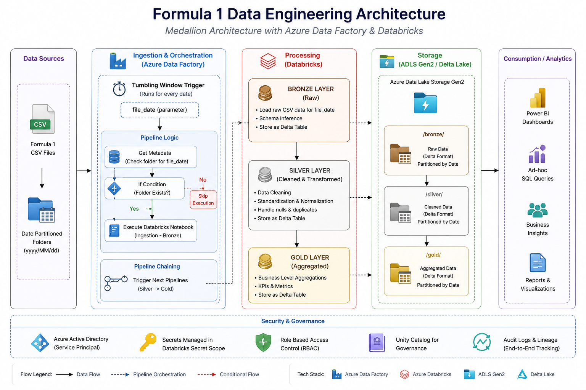
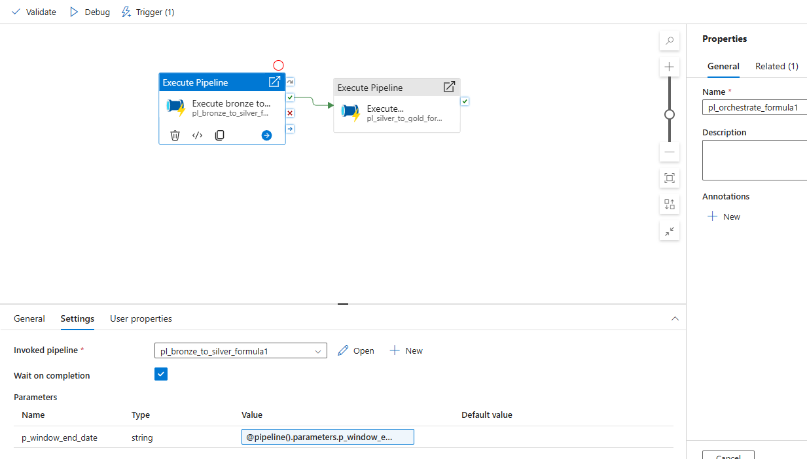
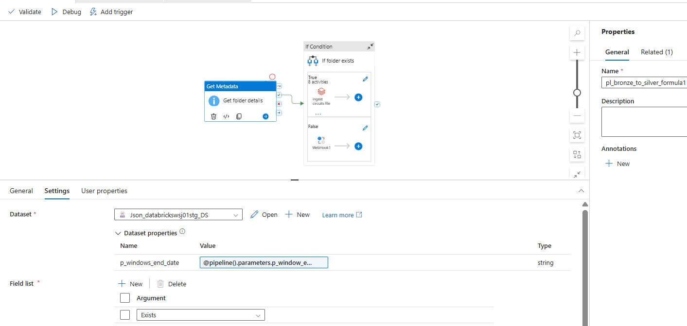
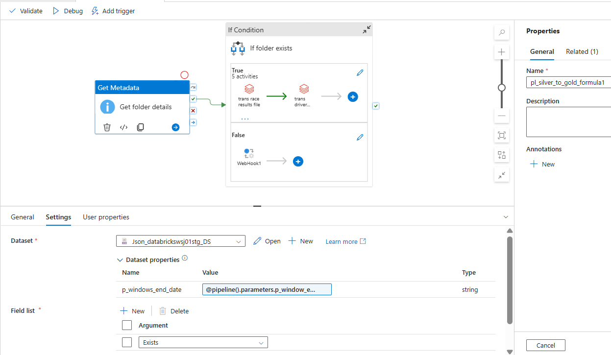
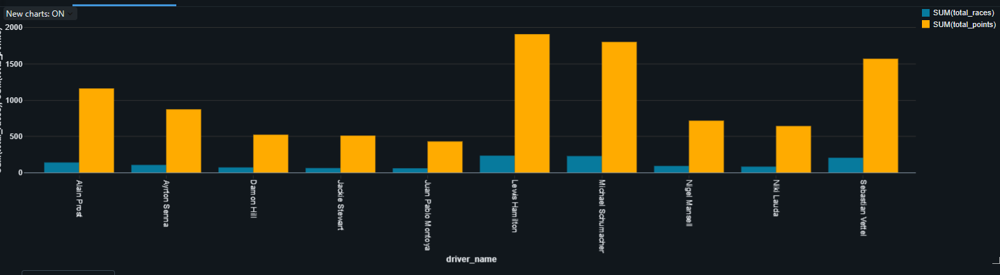

# 🏎️ Formula 1 Data Engineering Project

🚀 End-to-end Azure Data Engineering pipeline using Databricks, PySpark, and Azure Data Factory, implementing Medallion Architecture with incremental data processing.

💡 Built with focus on scalability, modular orchestration, and efficient data processing.

---

## 📌 Overview
📌 Designed to simulate a real-world production data pipeline using Azure ecosystem.

This project demonstrates a production-style data pipeline to process Formula 1 racing data from raw ingestion to analytics-ready datasets.

- Implements **Medallion Architecture (Bronze, Silver, Gold)**
- Orchestrated using **Azure Data Factory**
- Supports **incremental processing via date-based partitioning**
- Uses **metadata-driven execution for reliability**

---

## 🏗️ Architecture



The pipeline processes date-partitioned data from ADLS (Azure Data Lake Storage Gen2) using parameterized execution and orchestrates transformations across Bronze, Silver, and Gold layers through Azure Data Factory.

---

## 📸 Pipeline Orchestration (ADF)

### 🔹 Master Pipeline (Orchestration)
- Controls end-to-end execution  
- Triggers child pipelines sequentially  



---

### 🟤 Pipeline 1: Bronze → Silver
- Ingests raw data from ADLS (Azure Data Lake Storage Gen2)
- Validates data availability using metadata-driven checks
- Transforms data into structured format  



---

### 🟡 Pipeline 2: Silver → Gold
- Applies business transformations  
- Generates aggregated datasets for analytics  



📌 Pipelines are executed sequentially using the **Execute Pipeline** activity in Azure Data Factory.

⚙️ Design follows modular pipeline architecture to ensure scalability and maintainability.

---

## 🌟 Key Highlights

- End-to-end pipeline from ingestion to analytics  
- Medallion Architecture implementation  
- Incremental processing using date-partitioned data  
- Metadata-driven orchestration using ADF  
- Modular and reusable Databricks notebooks  
- Secure authentication using Service Principal  
- Implemented Delta Lake MERGE (upsert) for incremental data processing

---

## 📊 Sample Analytics

Below is a sample insight generated from the Gold layer:



📌 Visualization showing total races vs total points for top drivers across seasons.

---

## 🔄 Data Flow

- Data stored in **Azure Data Lake Storage Gen2 (date-partitioned folders)**  
- ADF triggers execution via **tumbling window trigger**  
- `file_date` parameter passed dynamically  
- Metadata validation ensures data availability  
- Databricks processes data:
  - Bronze → Raw ingestion  
  - Silver → Transformation  
  - Gold → Aggregation  

---

## ⏱️ Incremental Processing

- Data processed based on **date partitions**  
- ADF passes runtime parameter (`file_date`)  
- Ensures efficient and scalable processing  
- Avoids reprocessing of historical data  
- Utilized Delta Lake MERGE INTO to efficiently handle inserts and updates (upserts)

---

## ⚙️ Tech Stack

- Azure Data Lake Storage Gen2  
- Azure Databricks  
- Azure Data Factory  
- PySpark  
- Delta Lake  
- Azure Active Directory (Service Principal)  

---

## 📂 Project Structure

```bash
formula1-data-engineering/
│
├── notebooks/
│   ├── ingestion/
│   ├── transformations/
│   └── analysis/
│
├── src/
│   └── utils/
│
├── docs/
├── requirements.txt
└── README.md
```
---

## ▶️ How to Run

1. Configure Azure Data Lake credentials  
2. Set up Databricks secret scope  
3. Trigger pipeline via Azure Data Factory  

---

## 🔐 Security

- Authentication using Service Principal  
- Secrets managed via Databricks Secret Scope  

---

## 📊 Key Insights

- Dominant drivers across seasons  
- Constructor performance trends  
- Race result aggregations  

---

## 🚀 Future Enhancements

- CI/CD integration using Azure DevOps  
- Monitoring and alerting setup  
